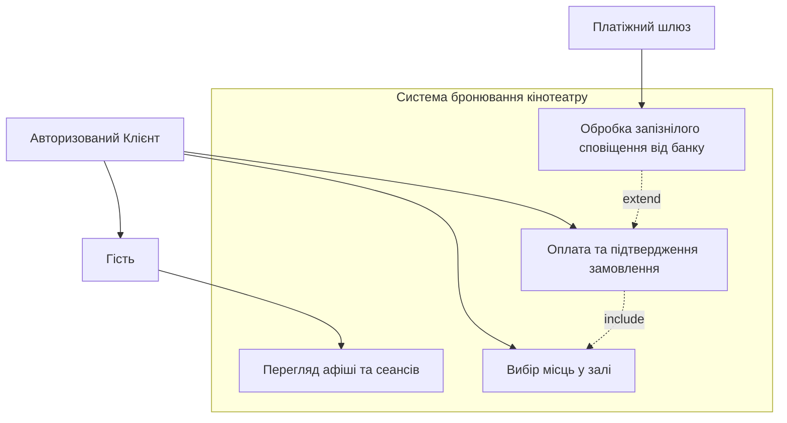

```mermaid
graph TD
    Guest[Гість]
    Client[Авторизований Клієнт]
    Gateway[Платіжний шлюз]

    Client --> Guest

    subgraph Система бронювання кінотеатру
        UC1[Перегляд афіші та сеансів]
        UC2[Оплата та підтвердження замовлення]
        UC3[Вибір місць у залі]
        UC4[Обробка запізнілого сповіщення від банку]
    end

    Guest --> UC1
    Client --> UC3
    Client --> UC2

    UC2 .->|include| UC3
    UC4 .->|extend| UC2

    Gateway --> UC4
```
