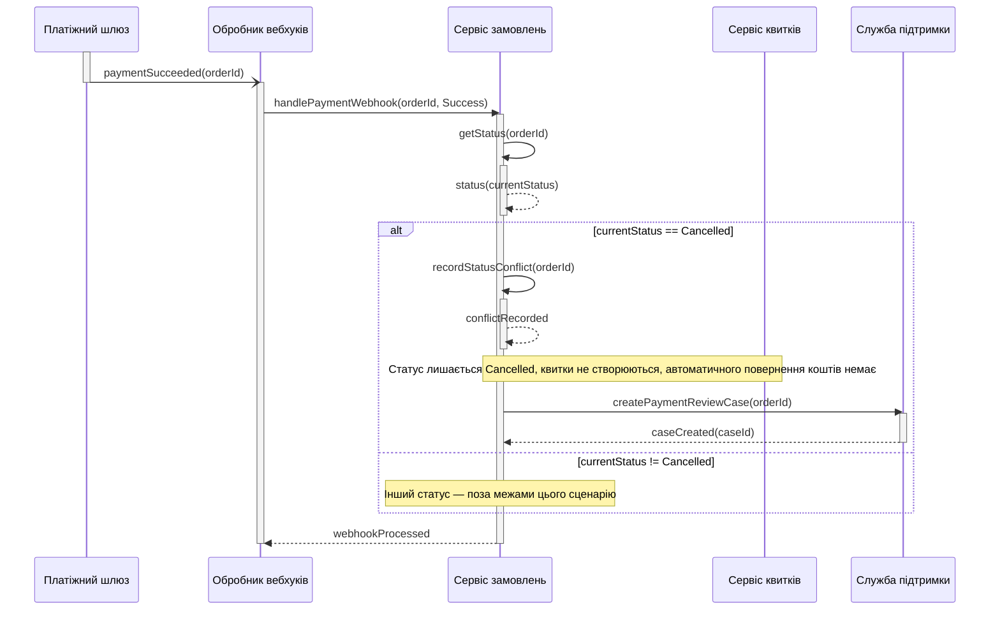

## Діаграма 4

```mermaid
sequenceDiagram
    participant Gateway as Платіжний шлюз
    participant Webhook as Обробник вебхуків
    participant Orders as Сервіс замовлень
    participant Tickets as Сервіс квитків
    participant Support as Служба підтримки

    activate Gateway
    Gateway-)Webhook: paymentSucceeded(orderId)
    deactivate Gateway

    activate Webhook
    Webhook->>Orders: handlePaymentWebhook(orderId, Success)
    activate Orders
    Orders->>Orders: getStatus(orderId)
    activate Orders
    Orders-->>Orders: status(currentStatus)
    deactivate Orders
    alt currentStatus == Cancelled
        Orders->>Orders: recordStatusConflict(orderId)
        activate Orders
        Orders-->>Orders: conflictRecorded
        deactivate Orders
        Note over Orders,Tickets: Статус лишається Cancelled, квитки не створюються, автоматичного повернення коштів немає
        Orders->>Support: createPaymentReviewCase(orderId)
        activate Support
        Support-->>Orders: caseCreated(caseId)
        deactivate Support
    else currentStatus != Cancelled
        Note over Orders: Інший статус — поза межами цього сценарію
    end
    Orders-->>Webhook: webhookProcessed
    deactivate Orders
    deactivate Webhook
```
